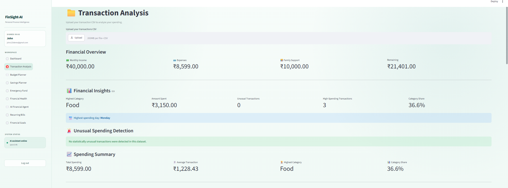

# FinSight-AI

### Personal Finance Intelligence Assistant

FinSight-AI is a privacy-focused personal finance application built with **Python and Streamlit**. It analyzes transaction data, tracks financial information, manages budgets, savings goals, recurring bills and emergency-fund planning, and provides explanations using a **locally running Qwen3:4B model through Ollama**.

A key design principle is the separation between **financial calculations and AI-generated explanations**. The application performs the numerical calculations first, then provides the prepared financial context to the local AI model for explanation.

## Features

### Transaction Analysis
- Upload and analyze transaction data
- Calculate financial statistics
- Analyze spending patterns and categories
- Identify high-spending and unusual transactions
- Generate visual summaries
- Save and review analyzed transactions

### Financial Planning
- Track monthly income and savings
- Manage monthly budgets
- Create savings plans
- Calculate emergency-fund requirements
- Track financial goals and progress
- Manage recurring bills

### Financial Health
Provides an overview based on application-calculated information including:

- Cash flow
- Spending patterns
- Savings
- Emergency readiness
- Areas for potential improvement

### Local AI Financial Agent

FinSight-AI includes a local AI assistant that can explain prepared financial information related to:

- Spending
- Savings
- Cash flow
- Budgets
- Recurring bills
- Financial goals
- Emergency savings

The application follows this flow:

**Application calculates → Financial Agent prepares context → Local AI explains**

The language model is therefore used primarily for contextual explanations rather than performing the underlying financial calculations.

## Privacy-Focused Design

FinSight-AI uses **Ollama** to run the Qwen3:4B model locally.

The application:

- Does not connect directly to bank accounts
- Does not execute financial transactions
- Does not make payments
- Uses application-prepared financial context for AI explanations
- Keeps local financial data outside the public repository through `.gitignore`

## Screenshots

The screenshots below demonstrate the main application workflow.

### Login & Authentication


### Personal Financial Information


### Transaction Analysis



### Budget Planner


### Savings Planner


### Emergency Fund Planner


### Financial Health


### Financial Overview


### Recurring Bills


### Financial Goals


> Screenshots use demonstration data and are intended to illustrate the application's interface and functionality.

## Technology Stack

- Python
- Streamlit
- Pandas
- NumPy
- Scikit-learn
- SQLite
- Ollama
- Qwen3:4B
- Jupyter Notebook
- Git & GitHub

## Project Structure

```text
FinSight-AI/
│
├── backend/
│   ├── __init__.py
│   ├── analysis.py
│   ├── database.py
│   ├── llm.py
│   ├── ai_advice.py
│   ├── financial_agent.py
│   ├── budget_store.py
│   └── savings_plan_store.py
│
├── data/
│   └── transactions.csv
│
├── frontend/
│   ├── app.py
│   └── bills.py
│
├── notebooks/
│   └── data_analysis.ipynb
│
├── screenshots/
├── .gitignore
├── requirements.txt
└── README.md
```

## Exploratory Data Analysis

The project includes a Jupyter notebook:

`notebooks/data_analysis.ipynb`

The notebook explores transaction data, spending patterns, and financial statistics used during development.

## How It Works

```text
┌─────────────────────┐
│    Streamlit UI     │
│    frontend/app.py  │
└──────────┬──────────┘
           │
           ▼
┌─────────────────────┐
│   SQLite Database   │
│    Financial Data   │
└──────────┬──────────┘
           │
           ▼
┌─────────────────────┐
│  Financial Analysis │
│     Calculations    │
└──────────┬──────────┘
           │
           ▼
┌─────────────────────┐
│   Financial Agent   │
│ Context Preparation │
└──────────┬──────────┘
           │
           ▼
┌─────────────────────┐
│       Ollama        │
│      Qwen3:4B       │
│     Local Model     │
└─────────────────────┘
```

**Application flow:**

**User → Streamlit → Financial calculations → Prepared context → Local AI explanation**

This architecture keeps numerical calculations within the application rather than relying on the language model to perform financial calculations.

## Running Locally

### 1. Clone the repository

```bash
git clone https://github.com/archasunil1111-jpg/FinSight-AI.git
cd FinSight-AI
```

### 2. Create a virtual environment

**Windows:**

```bash
python -m venv .venv
.venv\Scripts\activate
```

**macOS / Linux:**

```bash
python -m venv .venv
source .venv/bin/activate
```

### 3. Install dependencies

```bash
pip install -r requirements.txt
```

### 4. Install Ollama

FinSight-AI uses Ollama for local AI processing.

Verify the installation:

```bash
ollama --version
```

### 5. Download the Qwen3:4B model

```bash
ollama pull qwen3:4b
```

Verify the model:

```bash
ollama list
```

### 6. Start the application

```bash
python -m streamlit run frontend/app.py
```

Streamlit will provide the local application URL in the terminal.

## AI Safety & Privacy

FinSight-AI is an educational and portfolio project.

Important limitations:

- It does not connect directly to bank accounts.
- It does not execute financial transactions.
- It does not make payments.
- Financial calculations are performed by the application before AI explanation.
- The local AI assistant provides explanations based on application-prepared context.
- The application should not be treated as professional financial advice.
- Important financial decisions should be independently verified.

## Repository Privacy

The `.gitignore` file excludes local and potentially sensitive files such as:

```text
.venv/
__pycache__/
*.pyc
*.db
*.sqlite
.env
data/uploads/
data/_temp*
data/user*
data/uploaded_transactions_*.csv
data/budget_limits.json
data/savings_plans.json
.streamlit/secrets.toml
```

This helps keep local databases, uploaded financial information, temporary files, virtual environments, and machine-specific configuration out of the public repository.

## Project Purpose

FinSight-AI demonstrates how **traditional application logic, data analysis, database management, and local generative AI** can be combined in a privacy-focused personal finance application.

The project brings together:

- Data analysis
- Financial data processing
- SQLite database management
- Streamlit application development
- Local LLM integration
- AI-assisted explanations
- Budget and savings planning
- Emergency-fund planning
- Financial goal tracking
- Recurring-bill management

## Disclaimer

FinSight-AI is an educational and portfolio project.

It does not provide regulated financial advice, connect directly to bank accounts, or execute financial transactions. AI-generated explanations are informational and should not replace professional financial advice.

## Author

**Archa Sunil**

GitHub: [archasunil1111-jpg](https://github.com/archasunil1111-jpg)
