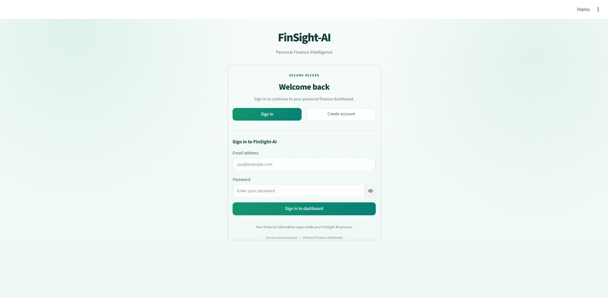
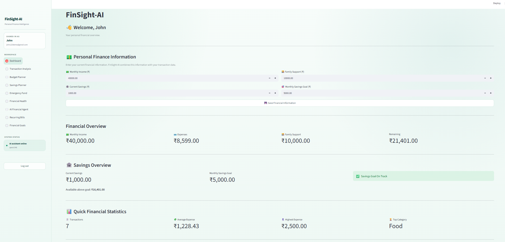
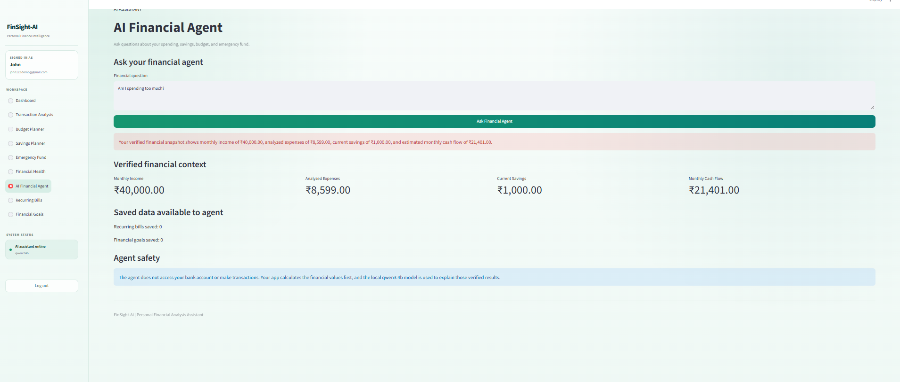
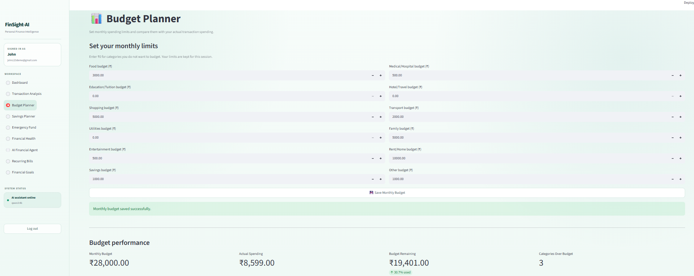
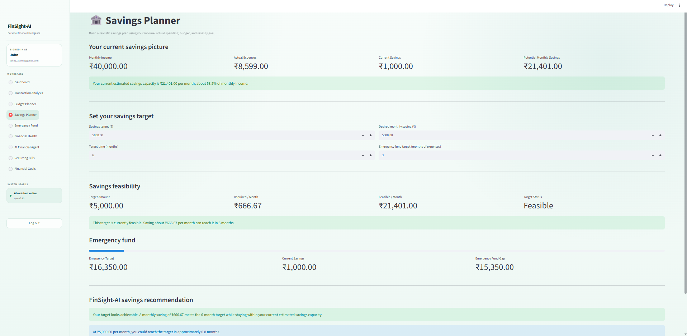
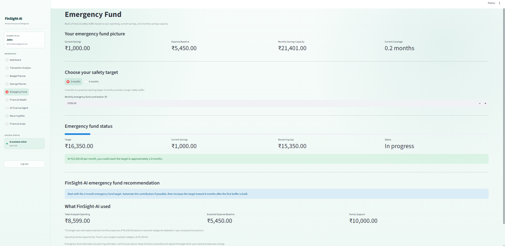
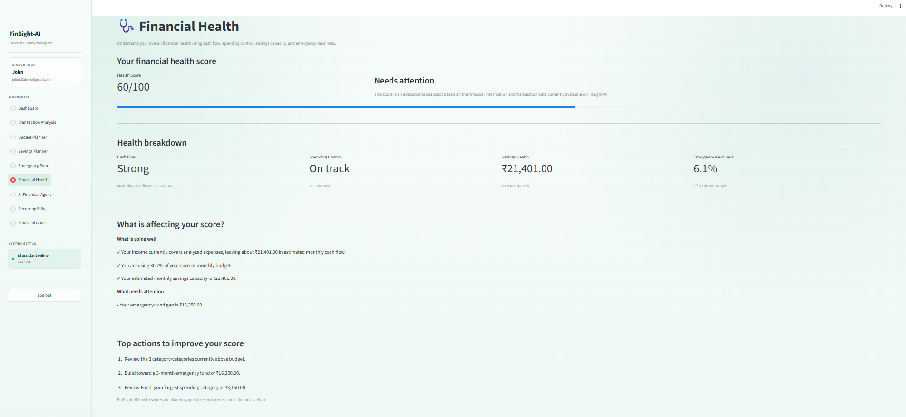
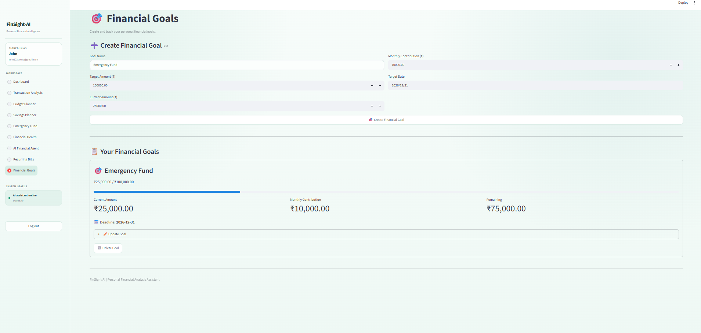
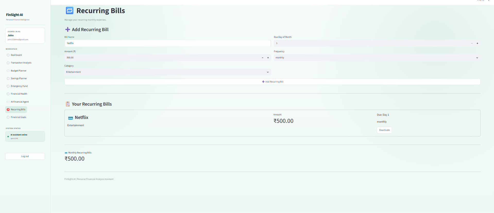

# FinSight-AI

**Personal Finance Intelligence Assistant**

FinSight-AI is a privacy-focused personal finance application built with **Python and Streamlit**. It analyzes transaction data, tracks personal financial information, manages recurring bills and financial goals, and provides financial explanations using a locally running **Qwen3:4B** model through **Ollama**.

The application separates financial calculations from AI-generated explanations. Financial values are calculated by the application first, and the local AI assistant receives the prepared financial context to explain the results.

---

## ✨ Features

### 📊 Transaction Analysis

- Upload transaction data for analysis
- Calculate financial statistics
- Analyze spending patterns and categories
- Identify high-spending and unusual transactions
- Generate visual summaries of transaction data
- Explore transaction data through a Jupyter notebook

### 💰 Financial Overview

- Track monthly income
- Track current savings
- Track monthly savings goals
- Track family support
- Calculate expenses
- Calculate remaining monthly cash flow
- View transaction count and spending statistics

### 🔁 Recurring Bills

- Add recurring monthly expenses
- Store bill categories and amounts
- Track recurring monthly-bill totals
- Store recurring due dates
- View recurring financial commitments separately from transaction analysis
- Deactivate recurring bills when required

### 🎯 Financial Goals

- Create financial goals
- Set target amounts
- Track current progress
- Set monthly contribution amounts
- Calculate remaining amounts
- Track goal deadlines
- Monitor progress toward financial targets

### 💼 Budget & Savings Planning

- Store monthly budget limits
- Create and manage savings plans
- Track planned savings contributions
- Compare planned budgets with financial activity
- Keep budgeting and savings information separate from transaction analysis

### 🚨 Emergency Fund Planning

- Calculate emergency-fund requirements
- Support different emergency-fund target periods
- Calculate funding gaps
- Track emergency-fund progress
- Provide an AI-generated explanation based on calculated financial information

### ❤️ Financial Health

The application provides a financial-health overview using application-calculated information such as:

- Cash flow
- Spending control
- Savings health
- Emergency readiness
- Factors affecting the financial-health result
- Suggested areas for improvement

### 🤖 AI Financial Agent

FinSight-AI includes a local AI financial assistant that can explain prepared financial information related to:

- Spending
- Savings
- Monthly cash flow
- Recurring bills
- Financial goals
- Budget information
- Emergency savings
- Financial planning

The application calculates relevant financial values first and then provides the prepared context to the local AI model.

This creates a simple separation:

**Application calculates → Financial Agent prepares context → Local AI explains**

The language model is therefore used primarily for contextual explanations rather than being responsible for the underlying financial calculations.

### 🔐 Privacy-Focused AI

FinSight-AI uses **Ollama** to run the language model locally.

The AI assistant:

- Does not directly connect to a bank account
- Does not execute financial transactions
- Does not make payments
- Receives financial context prepared by the application
- Uses a locally running **Qwen3:4B** model for explanations

Local databases, uploaded user files, temporary files, Python cache files, and virtual-environment files are excluded from Git using `.gitignore`.

---

## 🖼️ Screenshots

### 🔐 Login



Authentication and welcome screen for accessing the FinSight-AI workspace.

### 📊 Financial Overview



Main financial dashboard showing financial information, spending statistics, savings information, cash flow, and transaction insights.

### 💰 Personal Financial Information




Screen for entering and updating personal financial information such as monthly income, current savings, family support, and monthly savings goals.

### 💼 Budget Planner



Allows users to define monthly spending limits for different financial categories and compare planned budgets with actual spending.

### 💰 Savings Planner



Provides savings-planning information including income, expenses, current savings, potential monthly savings, savings targets, monthly contributions, and target duration.

### 🚨 Emergency Fund Planner



Calculates emergency-fund requirements, funding gaps, progress, and provides a local AI-generated explanation based on the calculated information.

### ❤️ Financial Health



Provides an overview of financial health using cash flow, spending, savings, and emergency-readiness information.

### 🎯 Financial Goals



Allows users to create and track financial goals using target amounts, current progress, monthly contributions, and target dates.

### 🔁 Recurring Bills



Allows users to add and manage recurring expenses with bill names, amounts, due dates, frequencies, and categories.

> Screenshots use demonstration data and are intended to illustrate the application's interface and functionality.

---

## 🛠️ Technology Stack

- **Python**
- **Streamlit**
- **Pandas**
- **NumPy**
- **Scikit-learn**
- **SQLite**
- **Ollama**
- **Qwen3:4B**
- **Jupyter Notebook**
- **Git & GitHub**

---

## 📁 Project Structure

```text
FinSight-AI/
│
├── backend/
│   ├── __init__.py
│   ├── analysis.py
│   ├── database.py
│   ├── llm.py
│   ├── ai_advice.py
│   ├── financial_agent.py
│   ├── budget_store.py
│   └── savings_plan_store.py
│
├── data/
│   └── transactions.csv
│
├── frontend/
│   ├── app.py
│   └── bills.py
│
├── notebooks/
│   └── data_analysis.ipynb
│
├── screenshots/
│   ├── login.png
│   ├── financial.png
│   ├── salary.png
│   ├── budgetplanner.png
│   ├── savingsplanner.png
│   ├── emergencyfund.png
│   ├── finanacialhealth.png
│   ├── goal.png
│   └── recuringbill.png
│
├── .gitignore
├── requirements.txt
└── README.md
```

---

## 🧩 Backend

The `backend` directory contains the application's financial processing, data-management, and AI-related logic.

| File | Purpose |
|---|---|
| `analysis.py` | Transaction and financial analysis |
| `database.py` | SQLite database operations |
| `llm.py` | Local LLM interaction through Ollama |
| `ai_advice.py` | AI-generated financial explanations |
| `financial_agent.py` | Financial context preparation and AI-agent logic |
| `budget_store.py` | Budget-related data management |
| `savings_plan_store.py` | Savings-plan data management |
| `__init__.py` | Python package initialization |

---

## 🖥️ Frontend

The `frontend` directory contains the Streamlit application interface.

| File | Purpose |
|---|---|
| `app.py` | Main FinSight-AI application interface |
| `bills.py` | Recurring-bill functionality |

---

## 📊 Data

The `data` directory contains repository-safe sample transaction data.

Local databases and user-specific uploaded financial files are excluded through `.gitignore`.

The application can work with uploaded transaction data without requiring those personal files to be committed to GitHub.

---

## 📓 Notebook

The project includes an exploratory data-analysis notebook:

```text
notebooks/data_analysis.ipynb
```

The notebook is used to explore transaction data, examine spending patterns, and support the development of the application's analytical functionality.

---

## 🔄 How It Works

```text
             ┌─────────────────────┐
             │    Streamlit UI     │
             │    frontend/app.py  │
             └──────────┬──────────┘
                        │
                        ▼
             ┌─────────────────────┐
             │   SQLite Database   │
             │   Financial Data    │
             └──────────┬──────────┘
                        │
                        ▼
             ┌─────────────────────┐
             │ Financial Analysis  │
             │    Calculations     │
             └──────────┬──────────┘
                        │
                        ▼
             ┌─────────────────────┐
             │   Financial Agent   │
             │ Context Preparation │
             └──────────┬──────────┘
                        │
                        ▼
             ┌─────────────────────┐
             │       Ollama        │
             │      Qwen3:4B       │
             │     Local Model     │
             └─────────────────────┘
```

The application follows this architecture:

**User → Streamlit → Financial calculations → Prepared context → Local AI explanation**

The purpose of this separation is to keep numerical financial calculations within the application rather than relying on the language model to perform the underlying calculations.

---

## 🚀 Running the Project Locally

### 1. Clone the repository

```bash
git clone https://github.com/archasunil1111-jpg/FinSight-AI.git
cd FinSight-AI
```

### 2. Create a virtual environment

#### Windows

```bash
python -m venv .venv
```

Activate it:

```bash
.venv\Scripts\activate
```

#### macOS / Linux

```bash
python -m venv .venv
source .venv/bin/activate
```

### 3. Install Python dependencies

Install the dependencies listed in `requirements.txt`:

```bash
pip install -r requirements.txt
```

### 4. Install Ollama

FinSight-AI uses Ollama for local AI processing.

Install Ollama separately and verify that it is available from the terminal:

```bash
ollama --version
```

### 5. Download the Qwen3:4B model

```bash
ollama pull qwen3:4b
```

Check the installed models:

```bash
ollama list
```

### 6. Start the application

From the project root:

```bash
python -m streamlit run frontend/app.py
```

Streamlit will display the local application URL in the terminal.

---

## 📦 Python Dependencies

The main Python dependencies are listed in:

```text
requirements.txt
```

Install them with:

```bash
pip install -r requirements.txt
```

Ollama and the Qwen3:4B model are installed separately because they are local AI infrastructure rather than Python packages.

---

## 🔒 AI Safety & Privacy

FinSight-AI is designed as a personal finance analysis and learning project.

### Important limitations

- The application does not connect directly to a bank account.
- The application does not execute financial transactions.
- The application does not make payments.
- The local AI assistant is used for explanations based on application-prepared context.
- Financial calculations are performed by the application before AI explanation.
- Local databases and user-uploaded financial files are excluded from Git.
- The application should not be treated as professional financial advice or a replacement for a qualified financial advisor.
- Users should independently verify important financial decisions.

---

## 🔐 Repository Privacy

The `.gitignore` file excludes local and potentially sensitive files such as:

```text
.venv/
__pycache__/
*.pyc
*.db
*.sqlite
.env
data/uploads/
data/_temp*
data/user*
data/uploaded_transactions_*.csv
data/budget_limits.json
data/savings_plans.json
.streamlit/secrets.toml
```

This helps keep local databases, uploaded financial information, temporary files, virtual environments, and other machine-specific files out of the public repository.

---

## 🎯 Project Purpose

FinSight-AI was developed as a practical portfolio project combining:

- Data analysis
- Financial data processing
- SQLite database management
- Streamlit application development
- Local LLM integration
- AI-assisted financial explanations
- Budget tracking
- Savings planning
- Financial goal tracking
- Recurring-bill management
- Privacy-focused local AI processing

The project demonstrates how traditional application logic and local generative AI can be combined while keeping financial calculations separate from language-model-generated explanations.

---

## 🌱 Future Improvements

Possible future improvements include:

- Improved transaction categorization
- More financial visualizations
- Enhanced budget analytics
- Additional savings-planning features
- More detailed goal tracking
- Improved AI-agent context handling
- Automated testing
- Better error handling and validation
- Additional financial-health analysis
- Deployment support for environments where local Ollama processing is available

---

## ⚠️ Disclaimer

FinSight-AI is an educational and portfolio project.

It does not provide regulated financial advice, connect directly to bank accounts, or execute financial transactions. AI-generated explanations are informational and should not replace professional financial advice.
